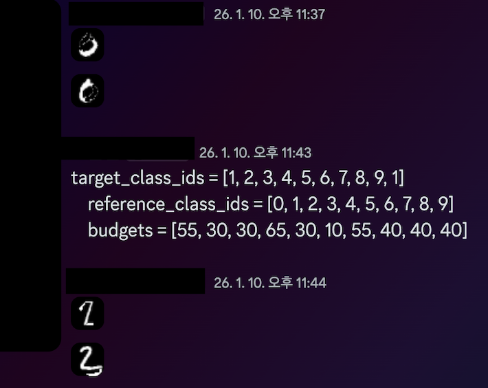
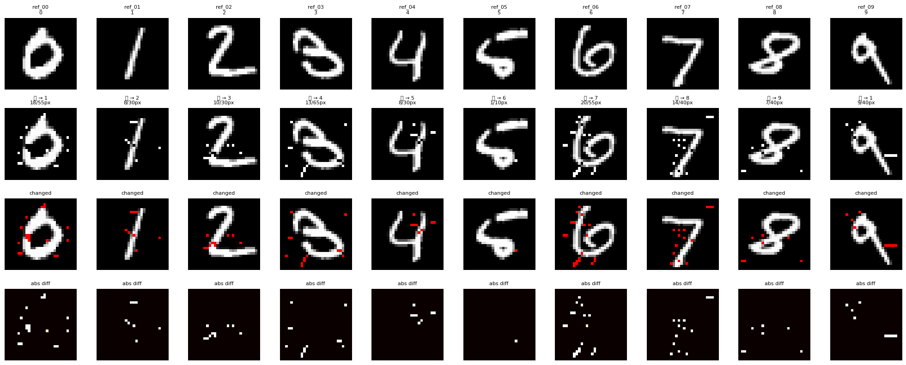

## overall
토요일, 10 1 2025, 09:00 KST - 월요일, 12 1 2025, 09:00 KST
### Team Rank
* 2372 score
* #8
### diary
아 넘 아까움 500점짜리 오신트문제 풀었으면 5등인데.. 아까웅..아까웅..하 포켓몬카드같은거에 내 시간을 쏟아야하나 하고 대충본게 넘 후회돼 5등한다고 누가 보상해주는거 아니지만~!!
### misc
`nec` md5가 같을것 +  budget이내의 픽셀차가 있을것 + cnn 에서 다른 숫자 이미지로 분류될것 / target이미지를 하나 만들어보고 그걸 md5가 같도록 조작해보는 문제

아아 너무 재밌엇다.. 난이도가 꽤 있는 문제였는데도 그냥 문제 자체가 넘 재밌었음 푸는 과정자체가

```
target_class_ids = [1, 2, 3, 4, 5, 6, 7, 8, 9, 1]
reference_class_ids = [0, 1, 2, 3, 4, 5, 6, 7, 8, 9]
budgets = [55, 30, 30, 65, 30, 10, 55, 40, 40, 40]
```
이 픽셀수 내에서 변경해서 0은 1, 1은 2, 2는 3..으로 인식되어야 함



~~그렇게 시작된 저능행동~~

일단은 budget을 통과하는 cnn이 다음 숫자로 인식하는 파일을 만들어야 했다. [주피터 노트북](u0ftctf2025/rec.ipynb)에 쓸만한 코드는 거의 하나도 없고 그냥 대부분 검증, 삽질이고 마지막 코드블록이 핵심이다 왜 정리를 안해서올렷냐면 어차피 클로드님이 쓰신코드인데 내가뭘더첨삭하리요

```
candidates = []

for r in range(28):
    for c in range(28):
        if (r, c) in changed_pixels:
            continue

        for new_val in [0, 64, 128, 192, 255]:
            if new_val == orig_arr[r, c]:
                continue

            # 임시로 변경
            old_val = adv_arr[r, c]
            adv_arr[r, c] = new_val

            # 예측
            test_img = Image.fromarray(adv_arr, mode="L")
            with torch.no_grad():
                x = bundle.preprocess_pil(test_img).unsqueeze(0).to(device)
                logits = bundle.model(x)
                probs = F.softmax(logits, dim=1)[0]
                target_prob = probs[target_class].item()

            candidates.append((target_prob, r, c, new_val))

            # 복원
            adv_arr[r, c] = old_val

if not candidates:
    break
```

그냥 greedy하게 찾는거다. 이미지가 28x28의 아주 작은 이미지이므로 걍 브포를 돌려버린다. 784개의 픽셀을 하나씩 변경해보되 256픽셀값을 가지면 너무 변경값이 많으니까 총 5가지의 gray픽셀값을 변경해보고 다시 cnn을 돌려본다. 확률이 어케바뀌었는지 본다. 좋으면 반영하고 안좋아졌으면 되돌린다. 



그러면 이렇게.. 몇 픽셀만 바뀌어도 다른 숫자로 인식하는 attack list가 완성된다.

이 문제를 내가 솔브하지는 못했는데 이유는 실제로 solver를 돌려보니까 MD5 COLLISION 을 내면 IHDR이 뒤로 가게 되면서 서버쪽의 load_gray_from_bytes를 통과를 못한다. 그래서 md5 collision을 서버에서 png를 잘 읽을수 잇도록.. 고려해서.. .내야하는데 md5 collision에 대한 명확한 이해 없이 냅다 스크립트를 돌려버리니까 안댐

그래서 팀원이 collision을 대신내줬는데 팀원이 collision낸 코드를 읽어봐도 어케 낸건지 이해가안됨 코드를 읽어보니까 png signature 부터 데이터를 잘라서 새로운 데이터를 만드는데 이러면 md5 collision 이 깨지지 않나? 머암튼 대단한팀 굿팀